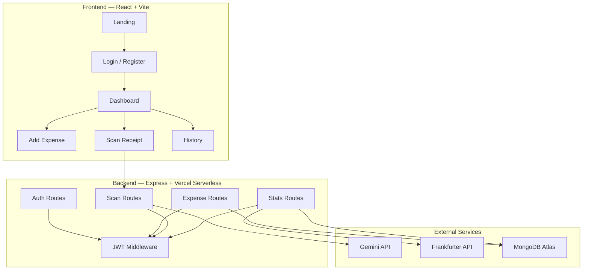

# SpendWise — Expense Tracker Walkthrough

## What Was Built

A full-stack expense tracking web app called **SpendWise** with:
- 🧾 **AI Receipt Scanning** — Gemini 2.0 Flash parses Thai & English receipts into structured data
- 📊 **Visual Dashboard** — Bar charts, doughnut charts, stats cards
- 💱 **Multi-Currency** — Automatic conversion via Frankfurter API
- 🎨 **Duolingo-Style UI** — Orange theme with 3D buttons, rounded cards, playful typography
- 🔐 **JWT Auth** — User accounts with secure login/register
- 🗄️ **MongoDB + Mongoose** — Full data persistence

---

## Screenshots

### Landing Page


### Feature Cards


### Login Page


### Register Page


---

## Architecture



---

## Project Structure

| Directory | Purpose |
|-----------|---------|
| `client/src/pages/` | 7 pages: Landing, Login, Register, Dashboard, AddExpense, ScanReceipt, History |
| `client/src/components/` | 7 reusable components: Navbar, StatsCard, ExpenseCard, CategoryBadge, CurrencySelector, LoadingSpinner, ProtectedRoute |
| `client/src/context/` | AuthContext for JWT session management |
| `client/src/utils/` | API client (Axios), categories, currencies |
| `server/routes/` | 4 route files: auth, expenses, scan, stats |
| `server/models/` | User + Expense Mongoose models |
| `server/services/` | Gemini + Currency API integrations |
| `server/middleware/` | JWT auth + Multer upload |
| `api/index.js` | Vercel serverless entry point |

---

## Key Design Decisions

1. **Gemini over OCR**: Uses Gemini 2.0 Flash for receipt parsing instead of traditional OCR. This gives structured JSON output directly, handles Thai+English natively, and requires no complex parsing logic.

2. **Duolingo 3D Buttons**: All primary buttons have a solid 4px bottom border creating the signature "pushable" 3D effect. Active state compresses the button down.

3. **Nunito Font**: Closest free alternative to Duolingo's proprietary font — rounded, playful, with heavy weights.

4. **Vercel Monorepo**: Frontend and backend deploy together on Vercel. The Express app exports as a module and runs as a serverless function via `api/index.js`.

5. **Currency Caching**: Exchange rates are cached in memory for 1 hour to minimize API calls.

---

## How to Run Locally

### 1. Create `.env` file

```bash
cp .env.example server/.env
```

Edit `server/.env` with your values:
```
MONGODB_URI=mongodb+srv://...
JWT_SECRET=pick-any-secret-string
GEMINI_API_KEY=your-key-from-aistudio.google.com
PORT=5000
```

### 2. Start the backend

```bash
cd server
npm run dev
```

### 3. Start the frontend (in another terminal)

```bash
cd client
npm run dev
```

### 4. Open the app

Visit **http://localhost:5173**

---

## How to Deploy to Vercel

1. Push the project to GitHub
2. Import the repo in [Vercel](https://vercel.com)
3. Add environment variables in Vercel's dashboard:
   - `MONGODB_URI`
   - `JWT_SECRET`
   - `GEMINI_API_KEY`
   - `NODE_ENV=production`
4. Deploy — Vercel auto-detects the config from `vercel.json`

---

## Testing Done

| Test | Result |
|------|--------|
| Frontend build (`npm run build`) | ✅ Builds successfully (664KB JS, 20KB CSS) |
| Landing page renders | ✅ Hero, feature cards, footer all visible |
| Login page renders | ✅ Form, 3D button, nav link working |
| Register page renders | ✅ All fields + currency selector visible |
| Routing works | ✅ All routes navigate correctly |
| Orange theme applied | ✅ Warm background, orange buttons/accents |
| Responsive design | ✅ Pages adapt to different viewports |
